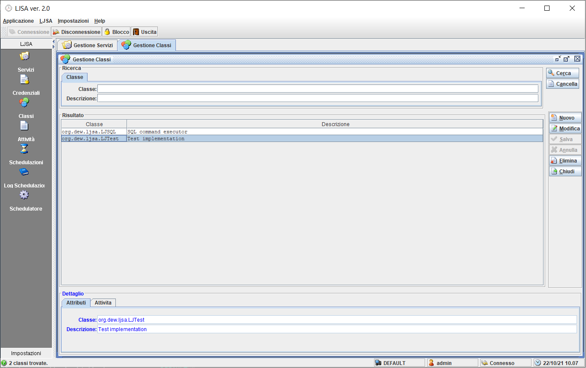
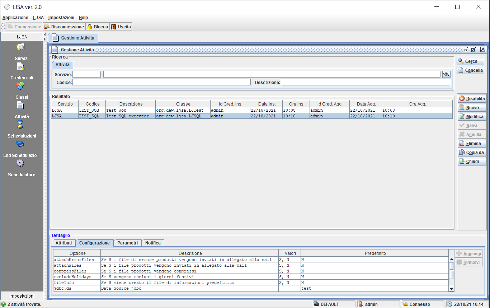
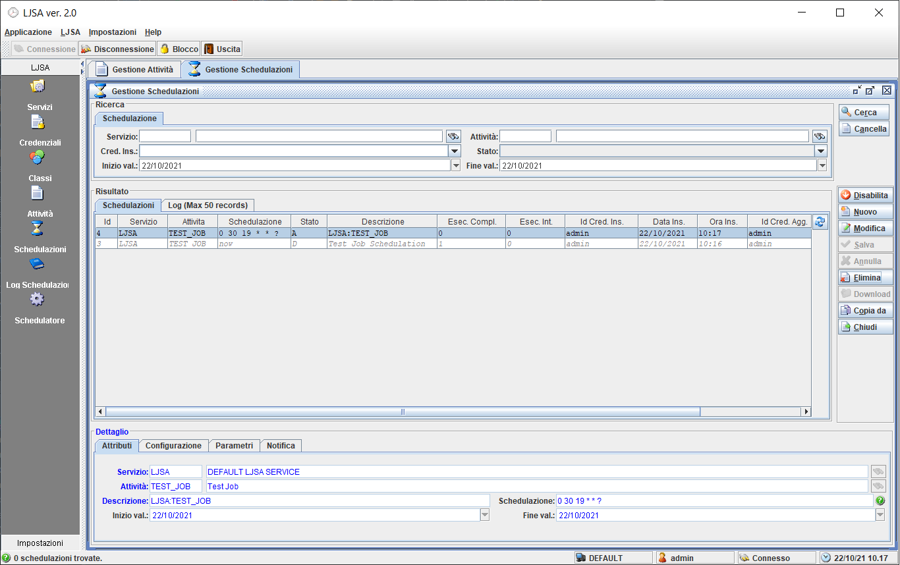
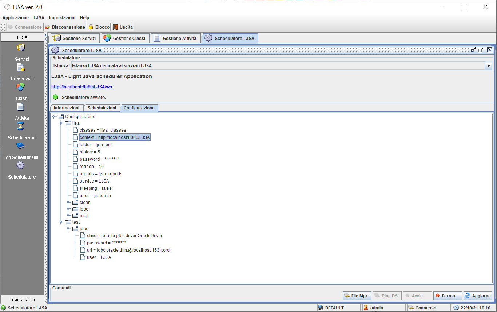
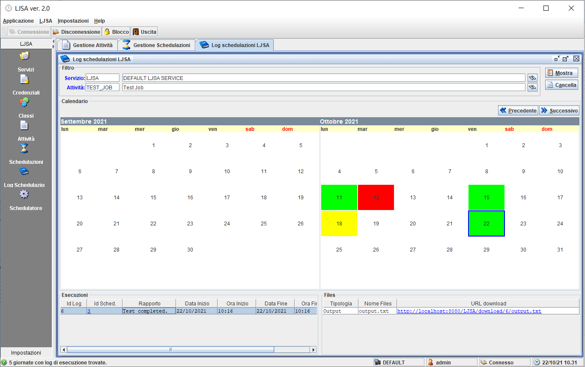
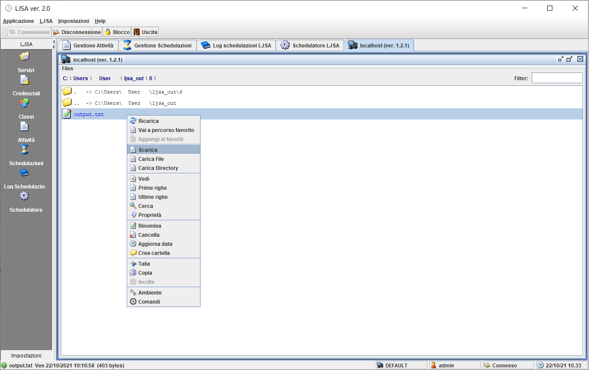

# LJSA - Light Java Scheduler Application

A job scheduler configurable through RESTful web services.

## Build

- `git clone https://github.com/giosil/LJSA.git`
- `mvn clean install`

## Run GUI (org.dew.swingup.main.Main) to manage services on http://localhost:8080/LJSA

### Define class

### Define activity

### Schedule activity

### View Job logs

### Check Scheduler

### Logs

### File Manager

## Contributors

* [Giorgio Silvestris](https://github.com/giosil)
