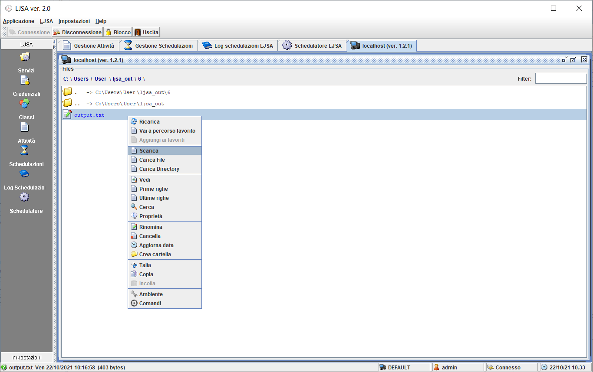

# LJSA - Light Java Scheduler Application

A job scheduler configurable through RESTful web services.

## Build

- `git clone https://github.com/giosil/LJSA.git`
- `mvn clean install`

## Implement a Job

```java
import java.io.PrintStream;

import org.dew.ljsa.ALJSAJob;
import org.dew.ljsa.LJSAMap;
import org.dew.ljsa.OutputSchedulazione;
import org.dew.ljsa.Schedulazione;

public 
class ExampleLJSAJob extends ALJSAJob
{
  protected PrintStream psLog;
  
  @Override
  public
  void init(Schedulazione sched, OutputSchedulazione out)
    throws Exception
  {
    LJSAMap configurazione = sched.getConfigurazione();
    LJSAMap parametri      = sched.getParametri();
    
    psLog = new PrintStream(out.createReportFile("report.txt"), true);
  }
  
  @Override
  public 
  void execute(Schedulazione sched, OutputSchedulazione out)
    throws Exception 
  {
    psLog.println("Hello World.");
    
    out.setReport("Job completed.");
  }
  
  @Override
  public
  void destroy(Schedulazione sched, OutputSchedulazione out)
    throws Exception
  {
  }
  
  @Override
  public
  void exceptionOccurred(Throwable throwable)
    throws Exception
  {
    throwable.printStackTrace(psLog);
    psLog.println("Job aborted.");
  }
}
```

## Run LJSA GUI (org.dew.swingup.main.Main) from LJSA-gui sub-project

### Define class


### Define activity


### Schedule activity


### View Job logs


### Check Scheduler


### Logs


### File Manager



## Launch LJSA GUI WebApp from LJSA-gui-web sub-project

### Dependencies

**wrapp**

- `git clone https://github.com/giosil/wrapp.git` 
- `mvn clean install` - this will produce `wrapp.war` in `target` directory

### Build and deploy web application with Wrapp

- Create if not exists `$HOME/cfg` directory
- Copy json files from `cfg` to `$HOME/cfg`
- Deploy `wrapp.war` in your application server
- `git clone https://github.com/giosil/LJSA.git` 
- `cd gui-web`
- `mvn clean install` - this will produce `wljsa.war` in `target` directory
- Launch `http://localhost:8080/wrapp`

### Define class


### Define activity


### Schedule activity


## Contributors

* [Giorgio Silvestris](https://github.com/giosil)
